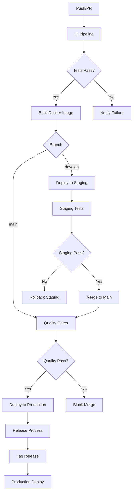

# GitHub Actions CI/CD Workflows

This directory contains the GitHub Actions workflows for the Espresso ML backend project.

## 🚀 Workflow Overview

### 1. **Continuous Integration** (`ci.yml`)
**Triggers:** Push to `main`/`develop`, Pull Requests

**Jobs:**
- **Code Quality**: TypeScript compilation, ESLint, Prettier checks
- **Unit Tests**: Jest test suite with coverage reporting
- **Integration Tests**: Database integration tests
- **Security Scanning**: Semgrep, npm audit
- **Build**: Docker image building and testing
- **Performance Tests**: Load testing with Artillery
- **Documentation**: API documentation generation

**Environment Variables:**
- `NODE_VERSION`: '18'
- `POSTGRES_VERSION`: '15'
- `REDIS_VERSION`: '7'

### 2. **Deployment** (`deploy.yml`)
**Triggers:** CI completion, manual dispatch, tags

**Environments:**
- **Staging**: Automatic deployment from `develop` branch
- **Production**: Blue-green deployment from `main` branch

**Features:**
- Kubernetes deployment with health checks
- Automatic rollback on failure
- Post-deployment security scanning
- Slack notifications

### 3. **Dependency Management** (`dependencies.yml`)
**Triggers:** Daily schedule, manual dispatch

**Jobs:**
- **Outdated Dependencies**: Check and create PRs for updates
- **Security Scan**: Vulnerability detection and reporting
- **License Compliance**: License validation
- **Bundle Analysis**: Size monitoring
- **Documentation Updates**: Auto-generate docs

### 4. **Code Quality** (`quality.yml`)
**Triggers:** Push, PR, weekly schedule

**Quality Gates:**
- **Coverage**: ≥80% threshold
- **Performance**: <500ms p95, <1% error rate
- **Code Style**: Zero ESLint errors
- **Documentation**: 100% coverage

### 5. **Release Management** (`release.yml`)
**Triggers:** Tags, manual dispatch

**Process:**
1. Semantic version bump
2. Changelog generation
3. Docker image publishing
4. GitHub release creation
5. Production deployment
6. Documentation update

## 🔧 Configuration

### Required Secrets

| Secret | Description | Required For |
|--------|-------------|--------------|
| `GITHUB_TOKEN` | GitHub access token | All workflows |
| `EMAIL_USERNAME` | Email address for notifications | All workflows |
| `EMAIL_PASSWORD` | Email password or app password | All workflows |
| `NOTIFICATION_EMAIL` | Recipient email address | All workflows |
| `DOCKER_USERNAME` | Docker Hub username | Release |
| `DOCKER_PASSWORD` | Docker Hub password | Release |
| `SEMGREP_APP_TOKEN` | Semgrep security scanning token | CI, Dependencies |
| `DEPLOYMENT_API_TOKEN` | Deployment API access | Deploy |
| `METRICS_API_TOKEN` | Metrics dashboard access | Quality |

### Environment Variables

| Variable | Default | Description |
|----------|---------|-------------|
| `NODE_VERSION` | '18' | Node.js version |
| `POSTGRES_VERSION` | '15' | PostgreSQL version |
| `REDIS_VERSION` | '7' | Redis version |
| `REGISTRY` | 'ghcr.io' | Container registry |

## 📊 Monitoring and Reporting

### Quality Metrics
- **Code Coverage**: Tracked via Codecov
- **Performance**: Lighthouse CI and Artillery
- **Security**: Snyk, npm audit, OWASP ZAP
- **Dependencies**: Automated updates and vulnerability scanning

### Notifications
- **Email**: Real-time notifications for all workflow events
- **GitHub Issues**: Automatic issue creation for critical problems
- **Pull Requests**: Automated comments with test results and coverage

### Artifacts
- **Test Reports**: Coverage reports, test results
- **Security Reports**: Vulnerability scans, SBOM
- **Performance Reports**: Load test results, Lighthouse reports
- **Documentation**: Generated API docs and changelogs

## 🚦 Workflow Status Badges

Add these badges to your README.md:

```markdown


```

## 🔍 Troubleshooting

### Common Issues

1. **Docker Build Failures**
   - Check Dockerfile syntax
   - Verify base image availability
   - Review build logs for specific errors

2. **Test Failures**
   - Check test environment setup
   - Verify database connections
   - Review test logs for specific failures

3. **Deployment Failures**
   - Check Kubernetes cluster connectivity
   - Verify secrets and configuration
   - Review deployment logs

4. **Security Scan Failures**
   - Review vulnerability reports
   - Update affected dependencies
   - Create security exceptions if necessary

### Debugging Steps

1. **Check Workflow Logs**: Navigate to Actions tab in GitHub
2. **Download Artifacts**: Review test reports and logs
3. **Local Reproduction**: Run failed steps locally
4. **Check Configuration**: Verify secrets and environment variables

## 📋 Best Practices

### Workflow Design
- Use matrix strategies for multiple environments
- Implement proper error handling and retries
- Use caching for dependencies and Docker layers
- Implement proper secrets management

### Testing
- Maintain high test coverage (>80%)
- Include unit, integration, and E2E tests
- Use test databases with proper cleanup
- Implement performance testing

### Security
- Regular security scanning
- Dependency vulnerability checks
- License compliance validation
- SBOM generation for releases

### Deployment
- Use blue-green deployment strategy
- Implement proper health checks
- Automatic rollback on failure
- Post-deployment verification

## 🔄 Workflow Interactions



## 📚 Additional Resources

- [GitHub Actions Documentation](https://docs.github.com/en/actions)
- [Kubernetes Deployment Guide](https://kubernetes.io/docs/concepts/workloads/controllers/deployment/)
- [Docker Best Practices](https://docs.docker.com/develop/dev-best-practices/)
- [Node.js Security Guidelines](https://nodejs.org/en/docs/guides/security/)

## 🤝 Contributing

When modifying workflows:

1. **Test Changes**: Create a feature branch and test thoroughly
2. **Documentation**: Update this README with changes
3. **Review**: Submit PR for review before merging
4. **Monitor**: Watch first few runs after deployment

## 📞 Support

For workflow-related issues:
- Check the Actions tab in GitHub
- Review workflow logs and artifacts
- Contact the DevOps team
- Create an issue with detailed information
