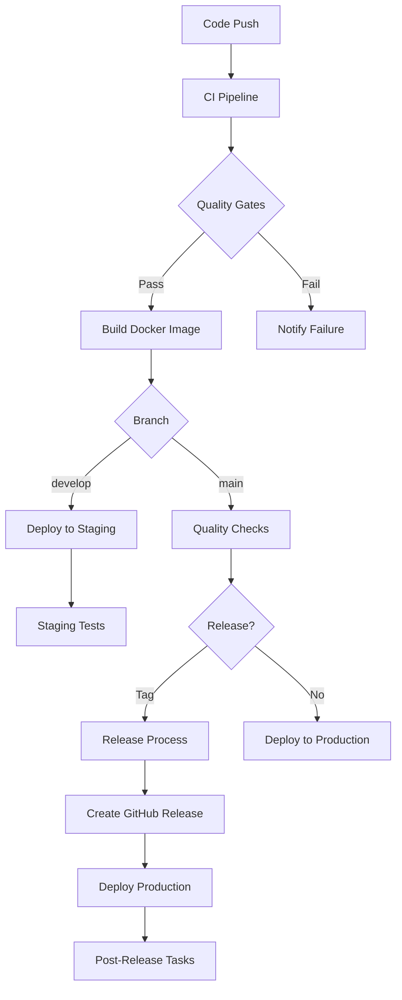
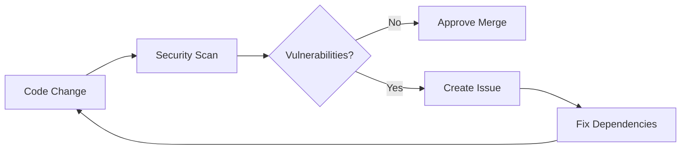

# 🚀 CI/CD Pipeline for Espresso ML Backend

This document provides a comprehensive overview of the Continuous Integration and Continuous Deployment (CI/CD) pipeline implemented using GitHub Actions.

## 📋 Table of Contents

- [🔄 Workflow Overview](#-workflow-overview)
- [🏗️ Pipeline Architecture](#️-pipeline-architecture)
- [🔧 Configuration](#-configuration)
- [🚦 Deployment Process](#-deployment-process)
- [📊 Monitoring and Quality Gates](#-monitoring-and-quality-gates)
- [🔒 Security](#-security)
- [📚 Documentation](#-documentation)
- [🛠️ Troubleshooting](#️-troubleshooting)

## 🔄 Workflow Overview

### 1. **Continuous Integration** (`.github/workflows/ci.yml`)

**Triggers:**
- Push to `main` or `develop` branches
- Pull requests targeting `main` or `develop`

**Pipeline Stages:**
1. **Code Quality** - TypeScript compilation, ESLint, Prettier checks
2. **Unit Tests** - Jest test suite with SQLite in-memory database
3. **Integration Tests** - PostgreSQL integration tests
4. **Security Scan** - npm audit, Snyk, CodeQL analysis
5. **Build** - Docker image building and testing
6. **Performance Tests** - Load testing with Artillery
7. **Documentation** - API documentation generation

### 2. **Deployment** (`.github/workflows/deploy.yml`)

**Environments:**
- **Staging**: Auto-deploy from `develop` branch
- **Production**: Blue-green deployment from `main` branch

**Features:**
- Kubernetes deployment with health checks
- Automatic rollback on failure
- Post-deployment security scanning
- Slack notifications

### 3. **Dependency Management** (`.github/workflows/dependencies.yml`)

**Schedule:** Daily at 2 AM UTC

**Features:**
- Outdated dependency detection and PR creation
- Security vulnerability scanning
- License compliance checking
- Bundle size analysis
- Documentation updates

### 4. **Code Quality** (`.github/workflows/quality.yml`)

**Schedule:** Weekly on Sundays at 3 AM UTC

**Quality Gates:**
- Code Coverage ≥ 80%
- Performance < 500ms p95, < 1% error rate
- Zero ESLint errors
- 100% documentation coverage

### 5. **Release Management** (`.github/workflows/release.yml`)

**Triggers:**
- Git tags (`v*`)
- Manual dispatch with version specification

**Process:**
1. Semantic version bump
2. Changelog generation
3. Docker image publishing
4. GitHub release creation
5. Production deployment
6. Documentation update

## 🏗️ Pipeline Architecture



## 🔧 Configuration

### Required Secrets

Configure these in your GitHub repository settings:

| Secret | Description | Required For |
|--------|-------------|--------------|
| `GITHUB_TOKEN` | GitHub access token | All workflows |
| `EMAIL_USERNAME` | Email address for notifications | All workflows |
| `EMAIL_PASSWORD` | Email password or app password | All workflows |
| `NOTIFICATION_EMAIL` | Recipient email address | All workflows |
| `DOCKER_USERNAME` | Docker Hub username | Release |
| `DOCKER_PASSWORD` | Docker Hub password | Release |
| `SNYK_TOKEN` | Snyk security token | CI, Dependencies |
| `DEPLOYMENT_API_TOKEN` | Deployment API access | Deploy |
| `METRICS_API_TOKEN` | Metrics dashboard access | Quality |

### Environment Variables

| Variable | Default | Description |
|----------|---------|-------------|
| `NODE_VERSION` | '18' | Node.js version |
| `POSTGRES_VERSION` | '15' | PostgreSQL version |
| `REDIS_VERSION` | '7' | Redis version |
| `REGISTRY` | 'ghcr.io' | Container registry |

### Tool Configuration Files

- **`.eslintrc.js`** - ESLint configuration with TypeScript support
- **`.prettierrc.json`** - Prettier code formatting rules
- **`.lighthouserc.json`** - Lighthouse CI performance testing configuration
- **`jest.config.js`** - Jest testing configuration
- **`tsconfig.json`** - TypeScript compiler configuration

## 🚦 Deployment Process

### Staging Deployment

1. **Trigger**: Push to `develop` branch
2. **Build**: Create Docker image with staging tag
3. **Deploy**: Apply Kubernetes manifests to staging namespace
4. **Verify**: Run smoke tests against staging environment
5. **Notify**: Send Slack notification with deployment status

### Production Deployment (Blue-Green)

1. **Trigger**: Tag push or manual dispatch
2. **Backup**: Create database and deployment backups
3. **Deploy Green**: Deploy new version to green environment
4. **Health Check**: Verify green deployment health
5. **Switch Traffic**: Route traffic to green environment
6. **Verify**: Run comprehensive smoke tests
7. **Cleanup**: Remove blue environment after stabilization period
8. **Rollback**: Automatic rollback if health checks fail

### Kubernetes Structure

```
k8s/
├── staging/
│   ├── configmaps/
│   ├── secrets/
│   ├── postgres/
│   ├── backend/
│   └── ingress/
└── production/
    ├── configmaps/
    ├── secrets/
    ├── postgres/
    ├── backend/
    └── ingress/
```

## 📊 Monitoring and Quality Gates

### Code Coverage

- **Tool**: Jest with coverage reporting
- **Threshold**: 80% minimum
- **Reporting**: Codecov integration
- **Badges**: Automatic coverage badge generation

### Performance Monitoring

- **Load Testing**: Artillery with configurable scenarios
- **Performance Budgeting**: Response time and error rate thresholds
- **Lighthouse CI**: Automated performance scoring
- **Metrics Dashboard**: Real-time performance tracking

### Security Scanning

- **Static Analysis**: CodeQL, ESLint security rules
- **Dependency Scanning**: npm audit, Snyk vulnerability detection
- **Container Scanning**: Trivy integration (if configured)
- **Runtime Security**: OWASP ZAP baseline scanning

### Quality Gates Implementation

```typescript
interface QualityGate {
  name: string;
  threshold: number;
  actual: number;
  status: 'PASS' | 'FAIL';
}

const qualityGates: QualityGate[] = [
  { name: 'coverage', threshold: 80, actual: 85, status: 'PASS' },
  { name: 'performance', threshold: 500, actual: 450, status: 'PASS' },
  { name: 'security', threshold: 0, actual: 0, status: 'PASS' },
  { name: 'style', threshold: 0, actual: 0, status: 'PASS' },
];
```

## 🔒 Security

### Security Measures

1. **Secret Management**
   - All secrets stored in GitHub repository secrets
   - No hardcoded credentials in code
   - Environment-specific secret access

2. **Vulnerability Scanning**
   - Automated daily security scans
   - PR security checks for new dependencies
   - Critical vulnerability immediate notification

3. **Container Security**
   - Minimal base images (Alpine Linux)
   - Non-root user execution
   - Security scanning of Docker images

4. **Network Security**
   - HTTPS enforcement in production
   - CORS configuration
   - Rate limiting implementation

### Security Workflow



## 📚 Documentation

### Auto-Generated Documentation

1. **API Documentation**: TypeDoc generated from TypeScript types
2. **Changelog**: Conventional commits automatic generation
3. **Architecture Diagrams**: Mermaid diagrams in workflow documentation
4. **Deployment Guides**: Environment-specific deployment instructions
5. **Notifications**: Real-time notifications for all workflow events

### Notifications

- **Email**: Real-time notifications for all workflow events
- **GitHub Issues**: Automatic issue creation for critical problems
- **Pull Requests**: Automated comments with test results and coverage

### Documentation Deployment

- **GitHub Pages**: Automatic deployment to `gh-pages` branch
- **Versioned Docs**: Documentation tagged with release versions
- **API Reference**: Real-time API documentation updates

## 🛠️ Troubleshooting

### Common Issues

#### 1. **Docker Build Failures**

**Symptoms:**
- Build fails during CI pipeline
- Docker layer cache issues

**Solutions:**
```bash
# Check Dockerfile syntax
docker --config .dockerfile

# Clear Docker cache
docker builder prune -f

# Check base image availability
docker pull node:18-alpine
```

#### 2. **Test Failures**

**Symptoms:**
- Unit tests failing in CI
- Integration test database connection issues

**Solutions:**
```bash
# Check test environment
npm run test:debug

# Verify database setup
docker logs postgres-container

# Run specific test file
npm test -- --testPathPattern=specific.test.ts
```

#### 3. **Deployment Failures**

**Symptoms:**
- Kubernetes deployment stuck in pending
- Health checks failing

**Solutions:**
```bash
# Check deployment status
kubectl get deployments -n espresso-production
kubectl describe deployment espresso-api -n espresso-production

# Check pod logs
kubectl logs -l app=espresso-api -n espresso-production

# Manual rollback
kubectl rollout undo deployment/espresso-api -n espresso-production
```

#### 4. **Performance Issues**

**Symptoms:**
- Load test failures
- Performance gate failures

**Solutions:**
```bash
# Check application logs
kubectl logs -f deployment/espresso-api -n espresso-production

# Monitor resource usage
kubectl top pods -n espresso-production

# Run performance test locally
artillery run artillery-config.yml
```

### Debugging Workflow Runs

1. **Access GitHub Actions**: Navigate to Actions tab in repository
2. **Download Artifacts**: Review test reports and logs
3. **Check Workflow Logs**: Examine individual step logs
4. **Local Reproduction**: Run failed commands locally
5. **Review Configuration**: Verify secrets and environment variables

### Performance Optimization

1. **Caching Strategy**
   - Node.js dependencies caching
   - Docker layer caching
   - Build artifact caching

2. **Parallel Execution**
   - Matrix strategies for multiple environments
   - Parallel test execution
   - Independent job execution

3. **Resource Optimization**
   - Minimal Docker images
   - Efficient resource allocation
   - Timeout configurations

## 📈 Metrics and KPIs

### Development Metrics

- **Build Time**: < 5 minutes
- **Test Execution Time**: < 3 minutes
- **Code Coverage**: > 80%
- **Security Score**: No critical vulnerabilities

### Deployment Metrics

- **Deployment Time**: < 10 minutes
- **Rollback Time**: < 2 minutes
- **Downtime**: < 1 minute per deployment
- **Success Rate**: > 95%

### Production Metrics

- **Response Time**: p95 < 500ms
- **Error Rate**: < 1%
- **Uptime**: > 99.9%
- **Performance Score**: Lighthouse > 80

## 🔄 Continuous Improvement

### Regular Reviews

1. **Monthly**: Pipeline performance review
2. **Quarterly**: Security audit and tool updates
3. **Annually**: Architecture and strategy review

### Feedback Loop

1. **Monitor**: Real-time pipeline monitoring
2. **Analyze**: Performance and failure patterns
3. **Optimize**: Iterative pipeline improvements
4. **Document**: Update documentation with learnings

## 📞 Support

For CI/CD related issues:

1. **Check Workflow Logs**: GitHub Actions tab
2. **Review Artifacts**: Download and analyze reports
3. **Consult Documentation**: Review this file and workflow READMEs
4. **Contact Team**: Create issue with detailed information

### Emergency Procedures

1. **Production Issues**: Immediate rollback procedure
2. **Security Incidents**: Emergency patch deployment
3. **Pipeline Failures**: Manual deployment process

---

**Last Updated**: $(date +%Y-%m-%d)
**Version**: 1.0.0
**Maintainers**: DevOps Team
